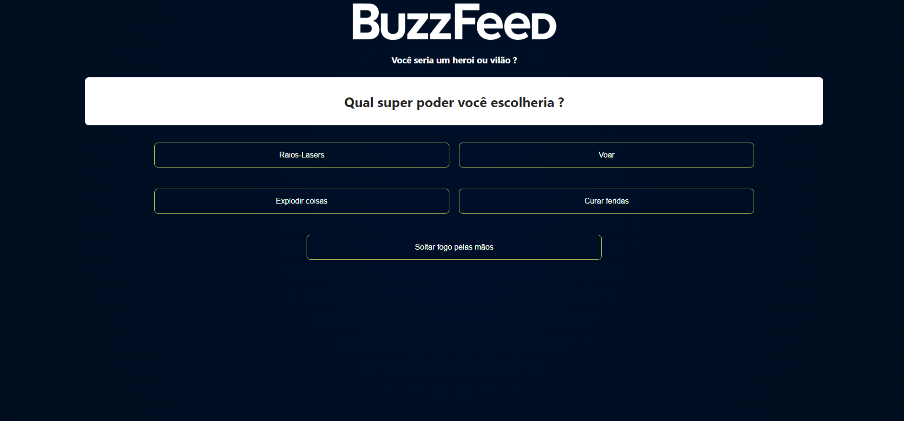

# BuzzfeedTest 🕹️

Criação de um mini-game ou um quiz, que gera um certo resultado de acordo com as escolhar do usuário. Projeto realizado a partir do curso de Angular da [DIO](https://www.dio.me/).
Projeto realizado inteiramente com Angular, colocando em prática tudo o que foi passado no curso e criando algo que seja lúdico e bem intuitivo!
Você pode acessar o projeto pronto através deste [LINK](https://1maatheus.github.io/angular-buzzfeed-tests/angular-buzzfeed/)!

## Preview do layout finalizado:

 
